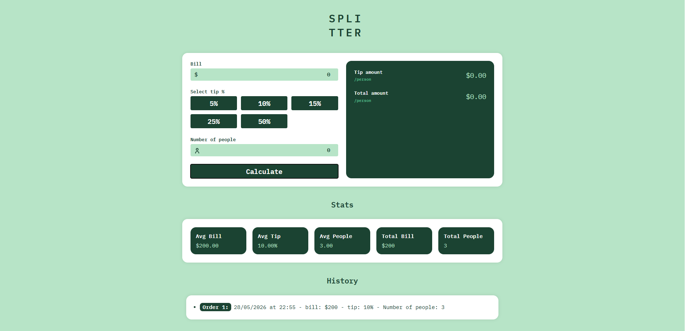

# Billing App

<br>
<div align="center">
  <a href="https://project-billing-app.netlify.app">
    
      <br><br> 
    
  </a>
</div>

<br>

## Tech Stack

<div>
  
  
  
  
  
</div>

## Key Features

- Interactive tip calculator
- Calculates the total bill including tip based on the selected percentage and number of people
- Extended functionality with two additional sections: statistics and history
- Fully responsive interface

## Getting Started

1. **Clone the repository:**

   ```bash
   git clone https://github.com/MarinaDiana01/billing-app.git
   cd billing-app
   ```

2. **Install dependencies:**

    ```bash
   npm install
   ```
3. **Start the development server:**

    ```bash
   npm run dev
   ```

    
